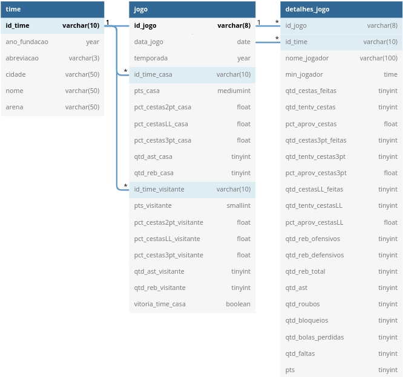

<p align="center">
  <a href="https://www.youtube.com/watch?v=dQw4w9WgXcQ" title="I'm a genius">
    
  </a>
</p>

# Projeto final do módulo 03 da Resilia

O projeto deste módulo era criar um dashboard com base no conjunto de dados escolhido pelo grupo, a fim de realizar uma apresentação com base na exploração dos dados, utilizando para isso o **SCRUM** como metodologia ágil para guiar o grupo durante as etapas de desenvolvimento do projeto.


## Um pouco sobre dados

A importância hoje em dia de conhecer os dados de uma aplicação e a partir disso tomar decisões importantes para o funcionamento e o sucesso da mesma é notória. Um bom exemplo disso é a série coreana da *Netflix* chamada **Round 6**, que atingiu em 2021 o título de série mais assistida da história da plataforma, em pouquíssimo tempo e graças a isso a Netflix tem encomendado cada vez mais séries coreanas para a sua plataforma, aumentando assim o número de visualizações para este público na plataforma e chamando a atenção de produtoras grandes na Coréia do Sul para esse mercado.


## Sobre o conjunto de dados escolhido pelo grupo

<p align="center">
  <a href="https://www.nba.com/" title="Site oficial da NBA">
    
  </a>
</p>

O conjunto de dados escolhido pelo grupo foi sobre a **NBA**, depois de uma rápida analisada visual nos dados, esse banco foi escolhido unanimamente pelo grupo pois atende as nossas expectativas no quesito gerar perguntas interessantes sobre o esporte e os jogos em si. Falando sobre os jogos, o banco disponibilizado cobre as estatísticas dos jogos das temporadas de 2003 até 2019, contendo informações sobre os jogos e estatíticas dos jogadores nesses jogos.

> O conjunto de dados usado pelo grupo pode ser encontrado/baixado [aqui](https://drive.google.com/drive/folders/1l6YSb2y33Mo2ki6glO3ulm8CpOA24PwX?usp=sharing).


## Tecnologias utilizadas no projeto

- [Trello](https://trello.com/) para a organização e a aplicação da metodologia **SCRUM** junto com o **Kanban** utilizadas no desenvolvimento do projeto, e que ajudou o grupo a se guiar e organizar o desenvolvimento das atividades.

- [dbDiagram](https://dbdiagram.io/) para a esquematização visual do banco de dados a partir da avaliação do conjunto de dados escolhido pelo grupo.

- [MySQL](https://www.mysql.com/) para a criação do banco de dados, armazenagem dos dados localmente e a análise do conjunto de dados feitas por consultas utilizando a linguagem **SQL**.

- [MySQL Workbench](https://www.mysql.com/products/workbench/) para a facilitação na manipulação do banco de dados e dos dados, de forma visual.

- [Metabase](https://www.metabase.com/) para a visualização dos dados a partir das perguntas dos integrantes do grupo.

- [Google Slides](https://www.google.com/slides/) para a criação da apresetação do projeto.


## Documentação do banco de dados

[**Aqui**](https://dbdocs.io/willy-r/NBA) você encontrará a documentação completa do banco de dados utilizado pelo grupo 7, como esquemas, tabelas, relacionamentos, campos e seus significados e muito mais.

### Diagrama ERR

O diagrama ERR do banco utilizado pelo grupo, a gente decidiu não mexer muito no que já vinha, apenas removendo algumas colunas e deixando as que atendessem ao grupo para as perguntas geradas, ele também pode ser melhor visualizado na [documentação do banco de dados](https://dbdocs.io/willy-r/NBA).

<p align="center">
  <a href="https://dbdocs.io/willy-r/NBA?view=relationships" title="Diagrama ERR do banco de dados escolhido pelo Grupo 7">
    
  </a>
</p>


## Instalação e uso do banco de dados no MySQL Workbench

### 1. Utilizando os schemas e os dados

1. Baixe o [schema](nba-db/nba-db-schema.sql) para a criação do banco de dados e das tabelas presente na pasta `nba-db`.

2. Carregue ele no MySQL Workbench (no canto superior esquerdo, vá em `File > Open SQL script` e escolha o arquivo baixado), e clique no símbolo de raio ⚡ para gerar o banco e as tabelas. Depois clique com o botão direito do mouse sobre os bancos listados na parte esquerda do programa e depois em "Refresh all", você verá o banco e as tabelas criadas.

3. Baixe os arquivos `.sql` presentes [neste link](https://drive.google.com/drive/folders/1l6YSb2y33Mo2ki6glO3ulm8CpOA24PwX?usp=sharing), no MySQL Workbench, no canto superior esquerdo, vá em `File > Open SQL script` e escolha o arquivo `times.sql` e clique no símbolo de raio ⚡ para inserir os dados na tabela **time**. O processo é repetido para `jogos.sql` e depois `detalhes_jogo.sql`, **nessa ordem**.

### 2. Utilizando o dump do banco de dados

1. Baixe a [pasta](nba-db/nba-dump-v1_1) contendo o dump do banco de dados disponível na pasta `nba-db`.

2. No MySQL Workbench, na parte superior vá em `Server > Data import`, deixe a primeira opção marcada, escolha o caminho da pasta baixada e clique em **Start import**.

Pronto, seguindo um dos procedimentos acima, os dados estarão carregados e prontos para serem consultados, se você quiser testar escreva no MySQL Workbench:

```sql
SELECT COUNT(*) FROM `time`;
SELECT COUNT(*) FROM jogo;
SELECT COUNT(*) FROM detalhes_jogo;
```

> **Obs**: Os dados podem demorar um pouco para serem importados, então espere pacientemente.


## Resultado do projeto

As consultas/perguntas e gráficos feitos pelo grupo podem ser encontrados [**aqui**](consultas).


## Integrantes do grupo 7/contribuidores

- [Ana Karolina](https://github.com/kasvrol)
- [Yasmin Reis](https://github.com/yasminreisk)
- [Vitor Santos](https://github.com/Santos-235)
- [Wellerson Ramos](https://github.com/WellHarper)
- [William Rodrigues](https://github.com/willy-r)
