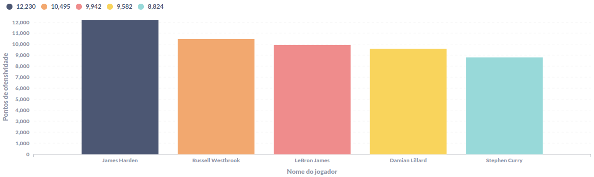
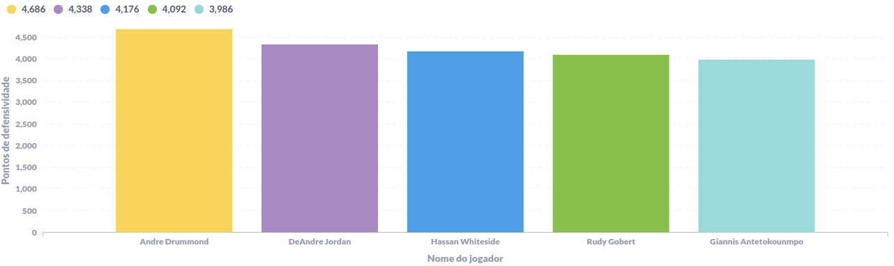

# Consultas feitas pelo grupo 7

Abaixo estão os gráficos de todas as perguntas feitas pelo grupo 7. Mas basicamente focamos em responder perguntas que pessoas que não entendem muito dos jogos da NBA ou de basquete em si se fariam para entender o jogo melhor e a importância dos jogadores para a NBA.

O tema foi basicamente fazer um "TOP 5" alguma coisa, **focando principalmente nas temporadas de 2015 à 2019**, que são contabilizadas como por exemplo 2015-16, pois a temporada começa em Outubro de um ano e termina em Abril do próximo ano.

## [Consultas - William Rodrigues](william-consultas.sql)

### Quais são os 5 times que mais ganharam jogos em casa?

  

### Quais são os 5 times que mais ganharam jogos fora de casa?

  

## [Consultas - Wellerson Ramos](well-consultas.sql)

### Quais são os 5 jogadores mais ofensivos?

  

### Quais são os 5 jogadores mais defensivos?

  

### Quais são os 5 jogadores que mais pontuam com cestas de 3 pontos?

  

## [Consultas - Yasmin Reis](yasmin-consultas.sql)

### Quais são os 5 jogadores que mais roubaram bolas?

  

### Quais são os 5 jogadores com maiores aproveitamentos de lances livres?

  

## [Consultas - Ana Karolina](ana-consultas.sql)

### Quais são os 5 jogadores que mais pontuaram (cestinhas)?

  

### Quais são os 5 jogadores que mais deram assistências?

  

## [Consultas - Vitor Santos](vitor-consultas.sql)

### Quais são os 5 jogadores que mais cometeram faltas?

  

### Quais são os 5 jogadores que mais perderam a posse de bola?

  

